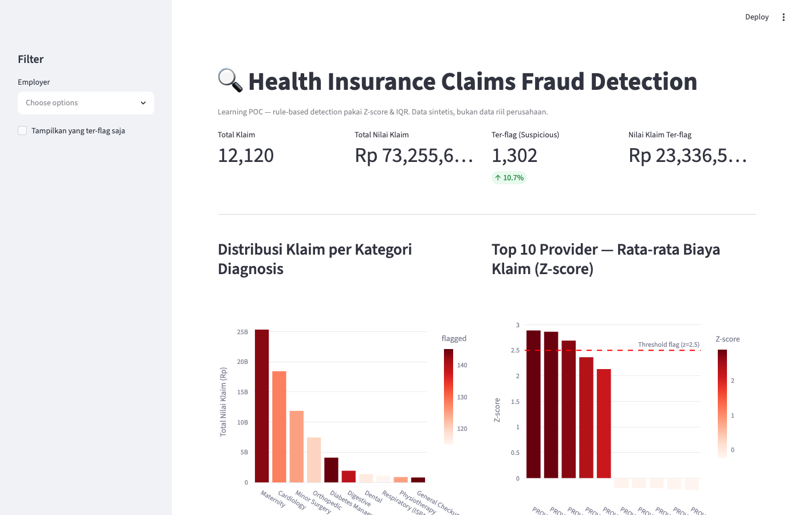
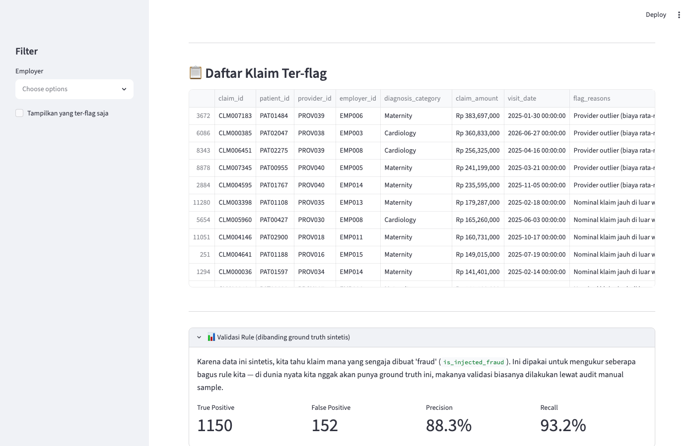

# Health Insurance Claims Fraud Detection

**Learning POC — Rule-based fraud detection untuk klaim asuransi kesehatan**

Sebuah eksplorasi pribadi soal actuarial science & claims analytics. Data sepenuhnya sintetis — tidak ada data perusahaan/nasabah riil yang dipakai.

> A personal exploration into actuarial science and claims analytics. All data is synthetic — no real company or customer data is used.

---

## 🧠 Learning Journey / Perjalanan Belajar

### 1. Z-score — Provider Outlier Detection

**ID:** Dipakai untuk mendeteksi provider (rumah sakit/klinik) yang rata-rata biaya klaimnya jauh di atas normal. Cocok karena kita membandingkan rata-rata per grup, bukan data mentah — distribusi rata-rata mendekati normal (Central Limit Theorem).

**EN:** Flags providers whose average claim cost is significantly above normal. Suitable because we're comparing group averages, not raw data — the distribution of means approximates normality (CLT).

### 2. IQR (Interquartile Range) — Amount Outlier per Diagnosis

**ID:** Mendeteksi nominal klaim yang aneh per kategori diagnosis. Biaya "Cardiology" wajar 12 juta, tapi biaya "General Checkup" 12 juta jelas aneh — jadi threshold harus spesifik per kategori. IQR lebih robust dari z-score untuk data biaya medis yang skewed (banyak klaim kecil, sedikit klaim besar).

**EN:** Flags unusual claim amounts within each diagnosis category. A "Cardiology" cost of 12M might be normal, but 12M for a "General Checkup" is suspicious — so thresholds are per-category. IQR is more robust than z-score for skewed medical cost data.

### 3. Frequency Check — Doctor Shopping Pattern

**ID:** Mendeteksi pasien yang klaim ≥4 kali dalam 30 hari. Bukan metode statistik murni, tapi business rule yang di-encode dari domain knowledge — pola klasik "doctor shopping" di industri asuransi.

**EN:** Flags patients with ≥4 claims within any 30-day window. Not purely statistical — a business rule encoded from domain knowledge, capturing classic "doctor shopping" patterns in insurance.

### 4. Precision & Recall — Rule Validation

**ID:** Karena data sintetis punya ground truth (`is_injected_fraud`), kita bisa mengukur seberapa akurat rule kita. Precision = seberapa banyak yang ter-flag benar-benar fraud. Recall = seberapa banyak fraud yang berhasil terdeteksi. Di dunia nyata, validasi biasanya lewat audit manual karena nggak ada ground truth.

**EN:** Since synthetic data has ground truth (`is_injected_fraud`), we can measure rule accuracy. Precision = how many flagged claims are actually fraud. Recall = how much fraud we actually catch. In the real world, validation relies on manual audit since there's no ground truth.

---

## 🚀 Run Locally

```bash
pip install -r requirements.txt
python generate_data.py          # regenerate dataset (optional, claims.csv already exists)
streamlit run app.py             # opens http://localhost:8501
```

---

## 📸 Dashboard


*Main view — metrics row, claims per category, top provider Z-score, IQR boxplot, flagged claims table.*


*Validation section — rule detection compared against synthetic ground truth (precision & recall).*

---

## 📁 Project Structure

```
├── app.py                  # Streamlit entrypoint (single page)
├── generate_data.py        # Generate synthetic dataset + inject fraud patterns
├── take_screenshots.py     # Playwright script for dashboard screenshots
├── analysis/
│   └── fraud_rules.py      # Z-score, IQR, frequency detection logic
├── data/
│   └── claims.csv          # Synthetic dataset (output of generate_data.py)
└── requirements.txt        # pandas, numpy, streamlit, plotly, scikit-learn
```
